# Duologue 도메인 모델

> 작성일: 2025-01-13
> 버전: 1.0
> 참고: [노션 기획서](https://www.notion.so/2a367a8aee258064969af812577c7058)

## 개요

Duologue 서비스의 핵심 도메인 엔티티와 관계를 정의한 문서입니다.
노션 기획서 분석을 바탕으로 데이터베이스 설계의 기초를 제공합니다.

---

## 핵심 도메인

### A. 회원 도메인

#### A.1. User (회원)

**역할**: 서비스 사용자 계정

**주요 속성**:

- ID (PK)
- Email (unique)
- 로그인 코드 (login_code, 6자리 숫자, nullable)
- 로그인 코드 만료 시각 (login_code_expires_at, nullable)
- 가입일, 최종 로그인
- 계정 상태 (active/suspended/deleted)

**관계**:

- 1:1 [Profile](#a2-profile-프로필)
- 1:1 [MatchTicket](#d1-matchticket-매칭-티켓)
- 1:1 [GameTicket](#d2-gameticket-게임-티켓)
- 1:1 [ContinueTicket](#d3-continueticket-이어하기-티켓)
- 1:N [Match](#b2-match-매칭) (매칭 참여)
- 1:N [Play](#c2-play-플레이-기록) (게임 플레이 기록)
- 1:N [Report](#g1-report-신고) (신고 이력 - 신고자/피신고자)
- 1:N [Order](#f1-order-주문) (주문 이력)

**비즈니스 규칙**:

- **Passwordless 인증**: 비밀번호 없이 이메일 + 로그인 코드만 사용
- 로그인 코드는 6자리 숫자, 5분간 유효
- JWT Access Token (15분) + Refresh Token (30일) 발급
- Refresh Token으로 30일간 자동 로그인 가능

---

#### A.2. Profile (프로필)

**역할**: 사용자의 프로필 정보 (기본/상세)

**주요 속성**:

- User ID (PK, FK, 1:1)
- **기본 프로필** (항상 열람 가능):
  - 닉네임 (unique)
  - 프로필 이미지 URL
  - 성별 (male/female/other)
  - 한줄 자기소개 (short_bio, 짧은 텍스트)
  - 관심사 (array or join table)
  - 지역
- **상세 프로필** (친밀함 상태에서만 열람 가능):
  - 소개말 (bio, 긴 텍스트)
  - 본명
  - 나이 (생년월일?)
  - 직업 (occupation)
  - 소속 (affiliation)
  - 학교 (school)
  - 미디어 (사진/영상 URLs, array)
  - 소셜 계정 (optional)
- **시스템 정보**:
  - 레벨 (level system)
  - 경험치 (exp)

**관계**:

- 1:1 [User](#a1-user-회원)
- 1:N [MatchPreset](#a3-matchpreset-매칭-조건-프리셋) (매칭 조건 설정)

**설계 참고**:

- user_id를 PK로 사용 (별도 id 불필요)

---

#### A.3. MatchPreset (매칭 조건 프리셋)

**역할**: 사용자가 미리 설정해둔 매칭 조건 템플릿

**주요 속성**:

- ID (PK)
- User ID (FK)
- 이름 (preset name, e.g. "평일 오후")
- 성별 조건 (male/female/any)
- 나이 범위 (min/max)
- 관심사 조건 (array)
- 기본 preset 여부 (is_default)

**비즈니스 규칙**:

- 매칭 요청 시 기본값으로 사용되는 템플릿
- 실제 매칭 시에는 [MatchCondition](#b1-matchcondition-매칭-조건-스냅샷)으로 스냅샷 저장

---

### B. 매칭 도메인

#### B.1. MatchCondition (매칭 조건 스냅샷)

**역할**: 매칭 시점에 각 사용자가 설정한 조건의 스냅샷

**주요 속성**:

- ID (PK)
- Match ID (FK)
- User ID (FK) - 이 조건을 설정한 사용자
- 성별 조건 (gender_preference: male/female/any)
- 최소 나이 (min_age)
- 최대 나이 (max_age)
- 관심사 조건 (interests, JSONB)
- 생성 시각

**관계**:

- N:1 [Match](#b2-match-매칭) (하나의 Match는 2개의 MatchCondition을 가짐)
- N:1 [User](#a1-user-회원)

**비즈니스 규칙**:

- 매칭 성립 시 양쪽 사용자의 조건을 각각 저장
- 이후 조건이 변경되어도 과거 매칭의 조건은 유지됨

---

#### B.2. Match (매칭)

**역할**: 두 사용자의 매칭 기록

**주요 속성**:

- ID (PK)
- User A ID (FK)
- User B ID (FK)
- 매칭 생성 시각
- 매칭 상태 (matched/active/closed)
- 친밀함 상태 (is_intimate, boolean, 3게임 이상 시 true)
- 삭제 시각 (deleted_at, nullable, soft delete)

**관계**:

- N:1 [User](#a1-user-회원) (User A)
- N:1 [User](#a1-user-회원) (User B)
- 1:2 [MatchCondition](#b1-matchcondition-매칭-조건-스냅샷) (양쪽 사용자의 매칭 조건)
- 1:N [Play](#c2-play-플레이-기록) (이 매칭에서 플레이한 게임들)
- 1:1 [ChatRoom](#e1-chatroom-대화방) (친밀함 상태가 되면 생성)
- 1:N [GameAppointment](#e3-gameappointment-게임-약속) (이 매칭에서의 게임 약속들)

**비즈니스 규칙**:

- 하루 새 매칭 3회 제한
- 매칭 시 각자 매칭 티켓 1개 소모
- **매칭 상태**:
  - `matched`: 대기열에서 매칭 성립, 아직 게임 시작 안 함
  - `active`: 한 번이라도 게임 진행함 (Play 기록 존재)
  - `closed`: 어느 한쪽이 매칭 거절/종료 (더 이상 게임 불가하지만 목록에는 보임)
- **프로필 공개**:
  - 새 매칭 시: 블러 처리된 프로필 이미지, 닉네임, 한줄 자기소개만 보임
  - 매칭 기록: 블러 해제된 프로필 이미지 보임
- **친밀함 상태**: 3게임 이상 진행 시 자동 전환
  - 상대방의 상세 프로필(본명, 나이, 직업 등) 열람 가능
  - 대화 기능 활성화
- **매칭 관리**:
  - 게임 전 거절 가능 (status = closed, 재게임은 가능)
  - 매칭 목록에서 삭제 가능 (soft delete, 목록에서 완전히 사라짐)

---

### C. 게임 도메인

#### C.1. Game (게임 종류)

**역할**: 플레이 가능한 게임 정의 (마스터 데이터)

**주요 속성**:

- ID (PK)
- 게임 코드 (spot_the_difference, raft, pelmanism, crossing)
- 게임 이름
- 게임 설명
- 음성 통화 필요 여부 (requires_voice)
- 활성화 여부 (is_active)

**시드 데이터**:

1. 틀린 그림 찾기 (spot_the_difference) - voice required
2. 뗏목 타기 (raft) - voice required
3. Pelmanism (pelmanism) - voice required
4. 길 건너기 (crossing) - voice required

---

#### C.2. Play (플레이 기록)

**역할**: 특정 매칭에서 진행한 게임 플레이 기록

**주요 속성**:

- ID (PK)
- Match ID (FK)
- Game ID (FK)
- User A ID (FK)
- User B ID (FK)
- 시작 시각
- 종료 시각
- 게임 결과 (success/fail/abandoned)
- 점수 (score, nullable)
- 게임 데이터 (JSONB, 게임별 커스텀 데이터)
- 재생 가능 여부 (is_replayable)

**관계**:

- N:1 [Match](#b2-match-매칭)
- N:1 [Game](#c1-game-게임-종류)
- N:1 [User](#a1-user-회원) (User A)
- N:1 [User](#a1-user-회원) (User B)

---

### D. 티켓 도메인

#### D.1. MatchTicket (매칭 티켓)

**역할**: 새로운 매칭을 요청할 때 사용하는 티켓

**주요 속성**:

- User ID (PK, FK, 1:1)
- 수량 (quantity)
- 최대 수량 (max_quantity, 기본 3개)
- 마지막 자동 충전 시각 (last_refill_at)

**비즈니스 규칙**:

- 하루 3개 자동 충전 (daily refill)
- 무료 티켓 최대 소지량: 3개
- 새로운 매칭 요청 시 1개 소모
- 구매 가능 (유료 티켓은 별도 최대 소지량 없음)
- **선물 불가**

---

#### D.2. GameTicket (게임 티켓)

**역할**: 매칭 히스토리에서 과거 매칭 상대와 재게임할 때 사용하는 티켓

**주요 속성**:

- User ID (PK, FK, 1:1)
- 수량 (quantity)
- 최대 수량 (max_quantity, 레벨에 따라 증가)
- 마지막 자동 충전 시각 (last_refill_at)

**비즈니스 규칙**:

- 하루 1개 자동 충전 (daily refill)
- 무료 티켓 최대 소지량: 레벨에 따라 증가
- **새로운 매칭으로 진행되는 게임에는 소모되지 않음** (중요)
- 과거 매칭 상대와 재게임 시 1개 소모 ([게임 약속](#e3-gameappointment-게임-약속) 통해)
- 구매 가능 (유료 티켓은 별도 최대 소지량 없음)
- 선물 가능

---

#### D.3. ContinueTicket (이어하기 티켓)

**역할**: 게임 종료 후 이어하기를 원할 때 텔레파시 게임을 건너뛰기 위한 티켓

**주요 속성**:

- User ID (PK, FK, 1:1)
- 수량 (quantity)
- 최대 수량 (max_quantity, 기본 1개)
- 마지막 자동 충전 시각 (last_refill_at)

**비즈니스 규칙**:

- 일주일에 1개 자동 충전 (weekly refill)
- 무료 티켓 최대 소지량: 1개
- 게임 종료 후 이어하기 시 텔레파시 게임 생략 가능
- 구매 가능 (유료 티켓은 별도 최대 소지량 없음)
- **선물 불가**

---

### E. 소셜 도메인

#### E.1. ChatRoom (대화방)

**역할**: 친밀함 상태가 되면 생성되는 채팅방

**주요 속성**:

- ID (PK)
- Match ID (FK, unique, 1:1)
- 생성 시각
- 상태 (active/closed)
- 삭제 시각 (deleted_at, nullable, soft delete)

**관계**:

- 1:1 [Match](#b2-match-매칭)
- 1:N [ChatMessage](#e2-chatmessage-채팅-메시지)

**비즈니스 규칙**:

- Match가 친밀함 상태(3게임 이상)가 되면 대화 기능 활성화
- 첫 대화 시도 시 ChatRoom 생성
- 친밀함 상태에서만 대화 가능

---

#### E.2. ChatMessage (채팅 메시지)

**역할**: 채팅방 메시지

**주요 속성**:

- ID (PK)
- ChatRoom ID (FK)
- Sender User ID (FK)
- 메시지 내용
- 전송 시각
- 읽음 여부 (is_read)

---

#### E.3. GameAppointment (게임 약속)

**역할**: 매칭 히스토리에서 과거 상대와 재게임하기 위한 약속

**주요 속성**:

- ID (PK)
- Match ID (FK)
- Proposer User ID (FK) - 게임 약속을 처음 제안한 사람 (고정)
- Receiver User ID (FK) - 받는 사람 (고정)
- Ticket Provider User ID (FK, nullable) - 티켓 제공자 (동봉 시에만, 보통 Proposer)
- Current Proposed Time (timestamp) - 현재 제안된 시간
- Status (pending/accepted/rejected/completed/cancelled)
- Created At
- Updated At
- Deleted At

**관계**:

- N:1 [Match](#b2-match-매칭)
- N:1 [User](#a1-user-회원) (Proposer)
- N:1 [User](#a1-user-회원) (Receiver)
- N:1 [User](#a1-user-회원) (Ticket Provider, nullable)
- 1:N [GameAppointmentHistory](#e4-gameappointmenthistory-게임-약속-히스토리)

**비즈니스 규칙**:

- 매칭 히스토리에서 과거 상대에게 재게임 제안 가능
- 재게임 시간 설정 가능
- 게임티켓 동봉 가능 (제안자가 2개 소모하여 상대방 티켓 대신 제공)
- 티켓 동봉 안 할 경우 각자 GameTicket 1개씩 소모
- 응답: 수락/수정(시간 등)/거절
- 히스토리를 통해 누가 언제 무슨 액션을 했는지 추적
- 약속 수락 후 양측이 모두 '입장' 상태가 되면 재게임 시작 (입장 상태는 WebSocket/Redis로 관리)

---

#### E.4. GameAppointmentHistory (게임 약속 히스토리)

**역할**: 게임 약속의 모든 변경 이력 추적

**주요 속성**:

- ID (PK)
- Appointment ID (FK)
- Actor User ID (FK) - 이 액션을 수행한 사람
- Action Type (initial_propose/modify_time/accept/reject/cancel)
- Proposed Time (timestamp, nullable) - 제안/수정된 시간 (accept/reject/cancel은 null)
- Message (text, optional) - 추가 메시지
- Created At

**관계**:

- N:1 [GameAppointment](#e3-gameappointment-게임-약속)
- N:1 [User](#a1-user-회원) (Actor)

**비즈니스 규칙**:

- 모든 상태 변경이 히스토리로 기록됨
- 누가 accept/reject/cancel 했는지 명확하게 추적 가능
- 시간 수정 제안도 모두 기록

---

### F. 상거래 도메인

#### F.1. Order (주문)

**역할**: 결제 및 아이템 구매 기록

**주요 속성**:

- ID (PK)
- User ID (FK)
- 주문 타입 (match_ticket/game_ticket/continue_ticket/replay_download)
- 수량
- 가격
- 결제 상태 (pending/completed/failed/refunded)
- 주문 시각
- 결제 완료 시각

---

#### F.2. Gift (선물)

**역할**: 사용자 간 티켓 선물

**주요 속성**:

- ID (PK)
- Sender User ID (FK)
- Receiver User ID (FK)
- 선물 타입 (game_ticket만 가능)
- 수량
- 메시지 (optional)
- 전송 시각
- 수령 여부 (is_received)
- 수령 시각

**비즈니스 규칙**:

- [GameTicket](#d2-gameticket-게임-티켓)만 선물 가능
- [MatchTicket](#d1-matchticket-매칭-티켓), [ContinueTicket](#d3-continueticket-이어하기-티켓)은 선물 불가

---

### G. 관리 도메인

#### G.1. Report (신고)

**역할**: 사용자/콘텐츠 신고

**주요 속성**:

- ID (PK)
- Reporter User ID (FK, 신고자)
- Reported User ID (FK, 피신고자)
- 신고 대상 타입 (user/profile_media)
- 신고 대상 ID (nullable, 미디어 URL 등)
- 신고 사유 (abuse/sexual/violence/aggression/spam/fraud)
- 상세 설명 (text, optional)
- 신고 시각
- 처리 상태 (pending/reviewed/actioned/dismissed)
- 처리 시각

---

## 엔티티 관계 다이어그램 (ERD)

```mermaid
erDiagram
    User ||--|| Profile : "has"
    User ||--|| MatchTicket : "owns"
    User ||--|| GameTicket : "owns"
    User ||--|| ContinueTicket : "owns"
    User ||--o{ Match : "participates as User A"
    User ||--o{ Match : "participates as User B"
    User ||--o{ MatchCondition : "sets condition"
    User ||--o{ Play : "plays"
    User ||--o{ Order : "makes"
    User ||--o{ Gift : "sends"
    User ||--o{ Gift : "receives"
    User ||--o{ Report : "reports"
    User ||--o{ Report : "reported by"
    User ||--o{ ChatMessage : "sends"
    User ||--o{ GameAppointment : "proposes"
    User ||--o{ GameAppointment : "receives"
    User ||--o{ GameAppointment : "provides ticket"
    User ||--o{ GameAppointmentHistory : "acts"

    Profile ||--o{ MatchPreset : "has"

    Match ||--o{ MatchCondition : "has conditions (User A + User B)"
    Match ||--o{ Play : "contains"
    Match ||--o| ChatRoom : "has"
    Match ||--o{ GameAppointment : "has appointments"

    ChatRoom ||--o{ ChatMessage : "contains"

    Game ||--o{ Play : "played in"

    GameAppointment ||--o{ GameAppointmentHistory : "has history"

    User {
        bigint id PK
        string email UK
        string login_code
        timestamp login_code_expires_at
        timestamp created_at
        timestamp last_login_at
        string status
    }

    Profile {
        bigint user_id PK,FK
        string nickname UK
        string profile_image_url
        string gender
        string short_bio
        text bio
        jsonb interests
        string region
        string real_name
        int age
        string occupation
        string affiliation
        string school
        jsonb media_urls
        jsonb social_accounts
        int level
        int exp
        timestamp created_at
        timestamp updated_at
    }

    MatchPreset {
        bigint id PK
        bigint user_id FK
        string name
        string gender_preference
        int min_age
        int max_age
        jsonb interests
        boolean is_default
        timestamp created_at
    }

    MatchCondition {
        bigint id PK
        bigint match_id FK
        bigint user_id FK
        string gender_preference
        int min_age
        int max_age
        jsonb interests
        timestamp created_at
    }

    Match {
        bigint id PK
        bigint user_a_id FK
        bigint user_b_id FK
        string status "matched/active/closed"
        boolean is_intimate
        timestamp created_at
        timestamp updated_at
        timestamp deleted_at
    }

    Game {
        bigint id PK
        string code UK
        string name
        text description
        boolean requires_voice
        boolean is_active
    }

    Play {
        bigint id PK
        bigint match_id FK
        bigint game_id FK
        bigint user_a_id FK
        bigint user_b_id FK
        timestamp started_at
        timestamp ended_at
        string result
        int score
        jsonb game_data
        boolean is_replayable
    }

    MatchTicket {
        bigint user_id PK,FK
        int quantity
        int max_quantity
        timestamp last_refill_at
        timestamp updated_at
    }

    GameTicket {
        bigint user_id PK,FK
        int quantity
        int max_quantity
        timestamp last_refill_at
        timestamp updated_at
    }

    ContinueTicket {
        bigint user_id PK,FK
        int quantity
        int max_quantity
        timestamp last_refill_at
        timestamp updated_at
    }

    ChatRoom {
        bigint id PK
        bigint match_id FK,UK
        string status
        timestamp created_at
        timestamp deleted_at
    }

    ChatMessage {
        bigint id PK
        bigint chat_room_id FK
        bigint sender_user_id FK
        text content
        boolean is_read
        timestamp sent_at
    }

    Order {
        bigint id PK
        bigint user_id FK
        string order_type
        int quantity
        decimal price
        string payment_status
        timestamp ordered_at
        timestamp completed_at
    }

    Gift {
        bigint id PK
        bigint sender_user_id FK
        bigint receiver_user_id FK
        string gift_type
        int quantity
        text message
        boolean is_received
        timestamp sent_at
        timestamp received_at
    }

    Report {
        bigint id PK
        bigint reporter_user_id FK
        bigint reported_user_id FK
        string target_type
        string target_id
        string reason
        text description
        string status
        timestamp reported_at
        timestamp processed_at
    }

    GameAppointment {
        bigint id PK
        bigint match_id FK
        bigint proposer_user_id FK
        bigint receiver_user_id FK
        bigint ticket_provider_user_id FK
        timestamp current_proposed_time
        string status
        timestamp created_at
        timestamp updated_at
        timestamp deleted_at
    }

    GameAppointmentHistory {
        bigint id PK
        bigint appointment_id FK
        bigint actor_user_id FK
        string action_type
        timestamp proposed_time
        text message
        timestamp created_at
    }
```

---

## 주요 비즈니스 흐름

### 흐름 0: Passwordless 회원가입 및 로그인

#### 회원가입

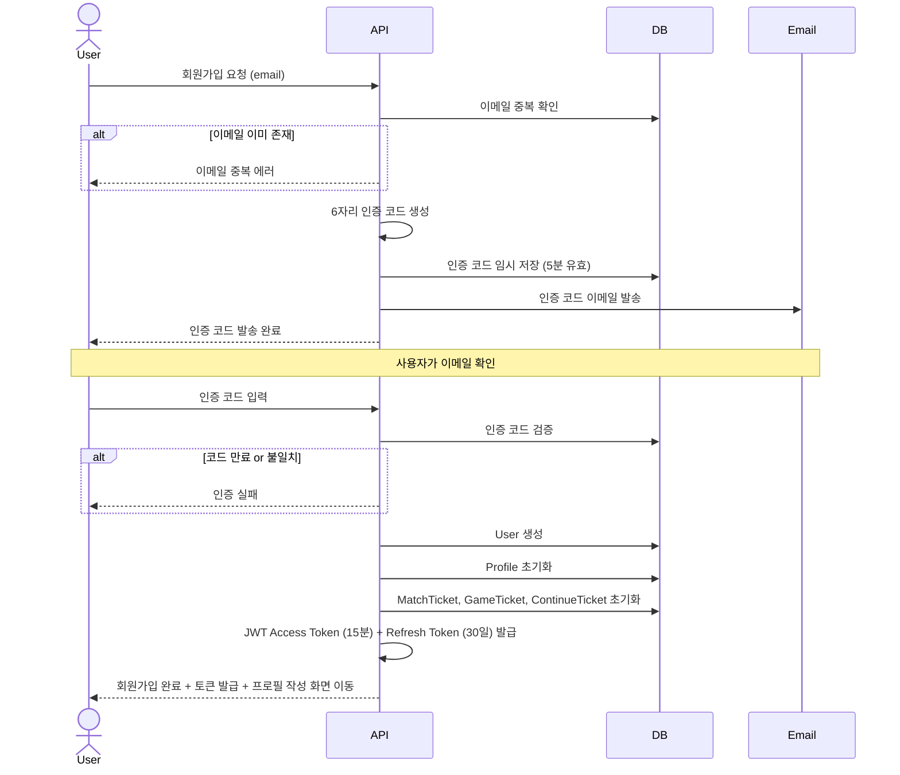

#### 로그인

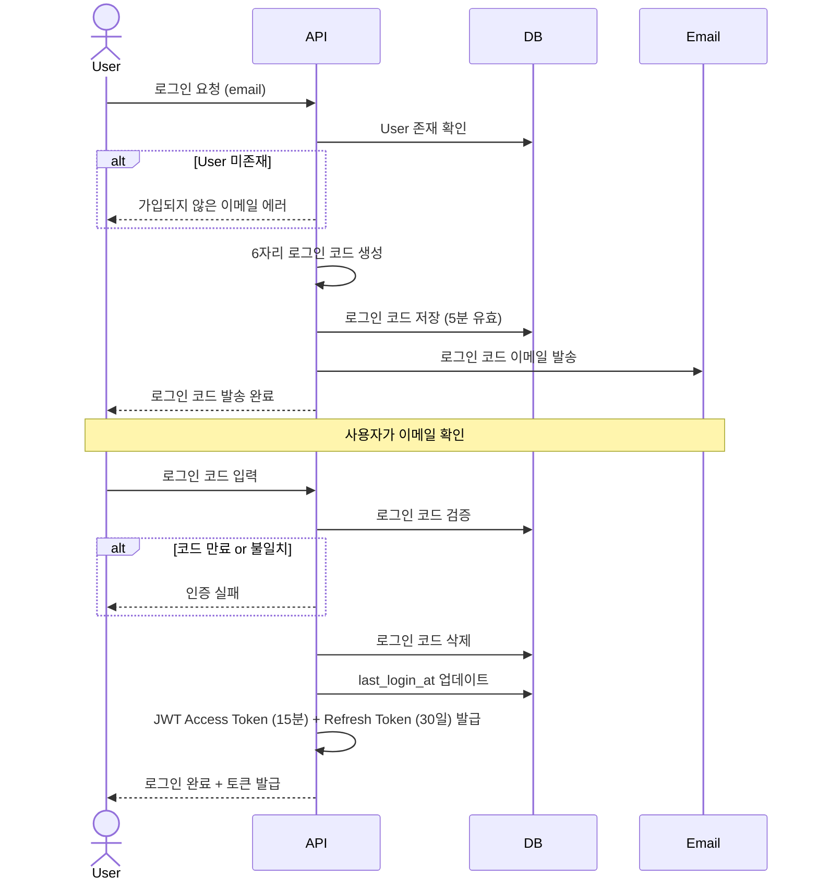

### 흐름 1: 새로운 매칭

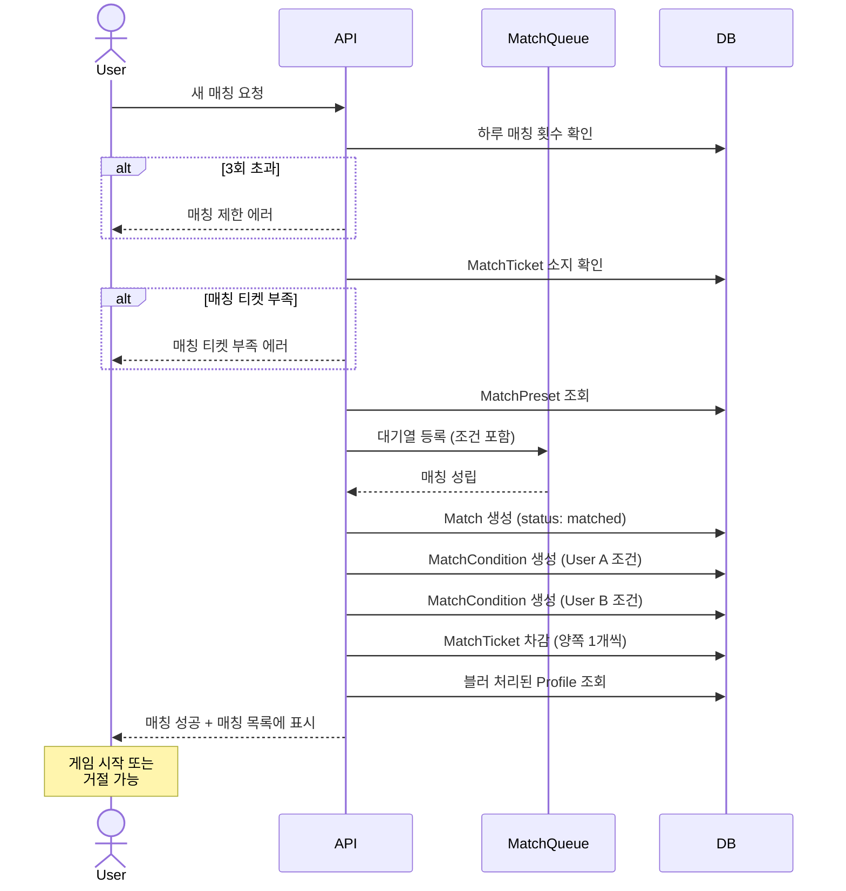

### 흐름 2: 게임 플레이 (새 매칭)

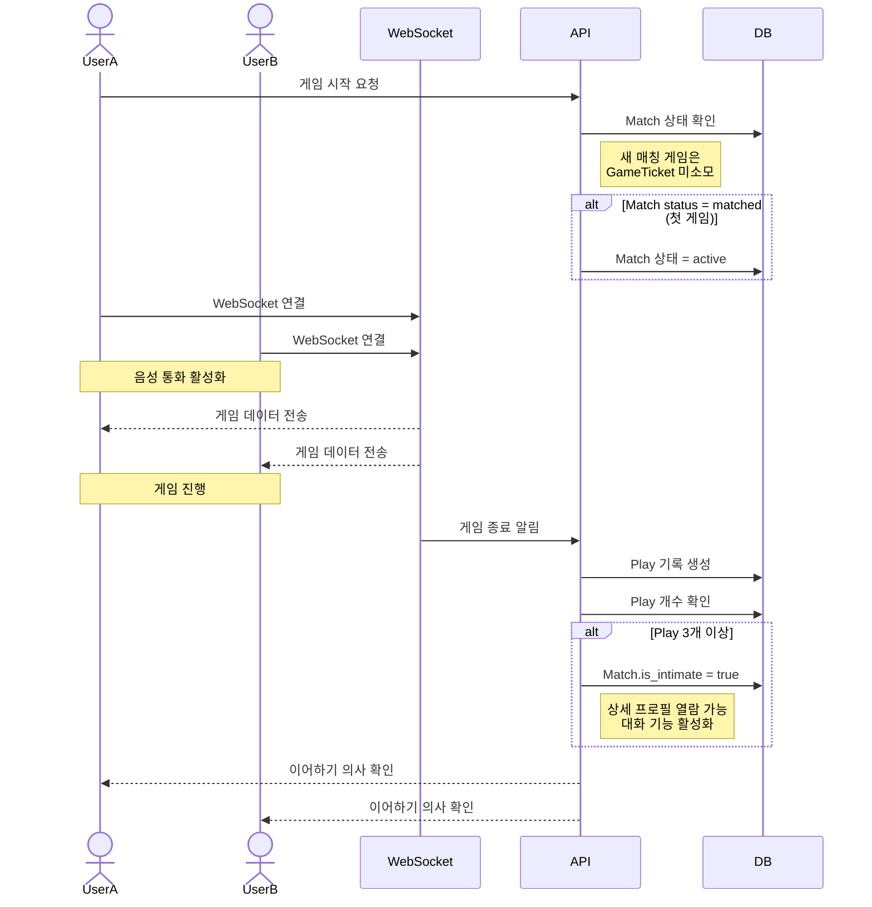

### 흐름 2-1: 재게임 (매칭 히스토리)

**참고**: 재게임은 [게임 약속(GameAppointment)](#e3-gameappointment-게임-약속)을 통해 이루어집니다. 자세한 흐름은 [흐름 5: 게임 약속](#흐름-5-게임-약속-재게임) 참조.

간단 요약:
1. UserA가 매칭 히스토리에서 과거 상대에게 재게임 제안
2. 게임 약속 생성 및 협의 (시간, 티켓 등)
3. 약속 수락 시 [GameTicket](#d2-gameticket-게임-티켓) 차감
4. 양측 입장 후 재게임 시작

### 흐름 3: 이어하기

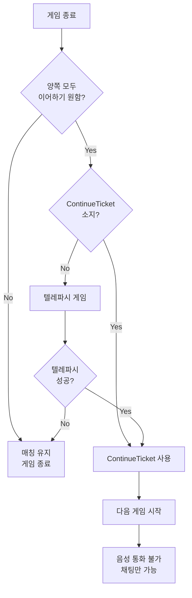

### 흐름 4: 친밀함 상태 및 대화 기능 활성화

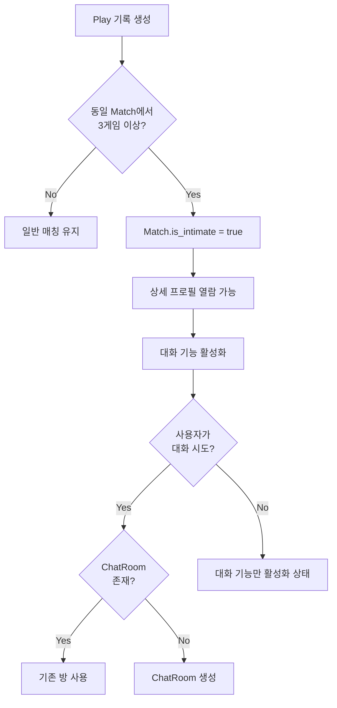

### 흐름 5: 게임 약속 (재게임)

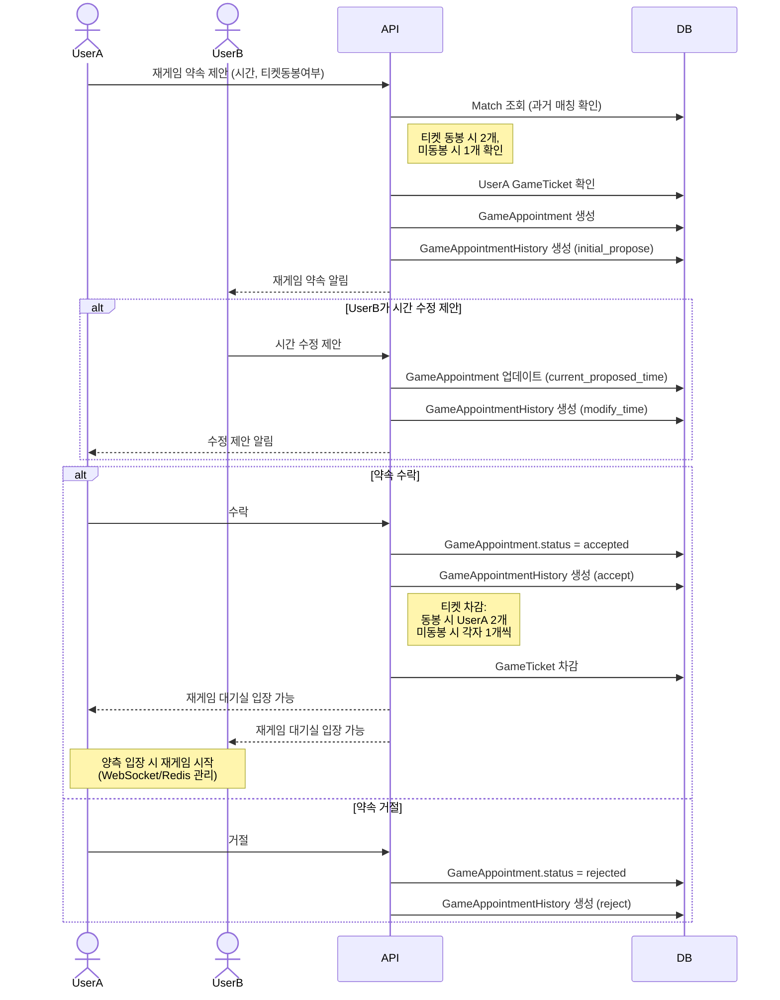

---

## 상태 다이어그램

### Match 상태

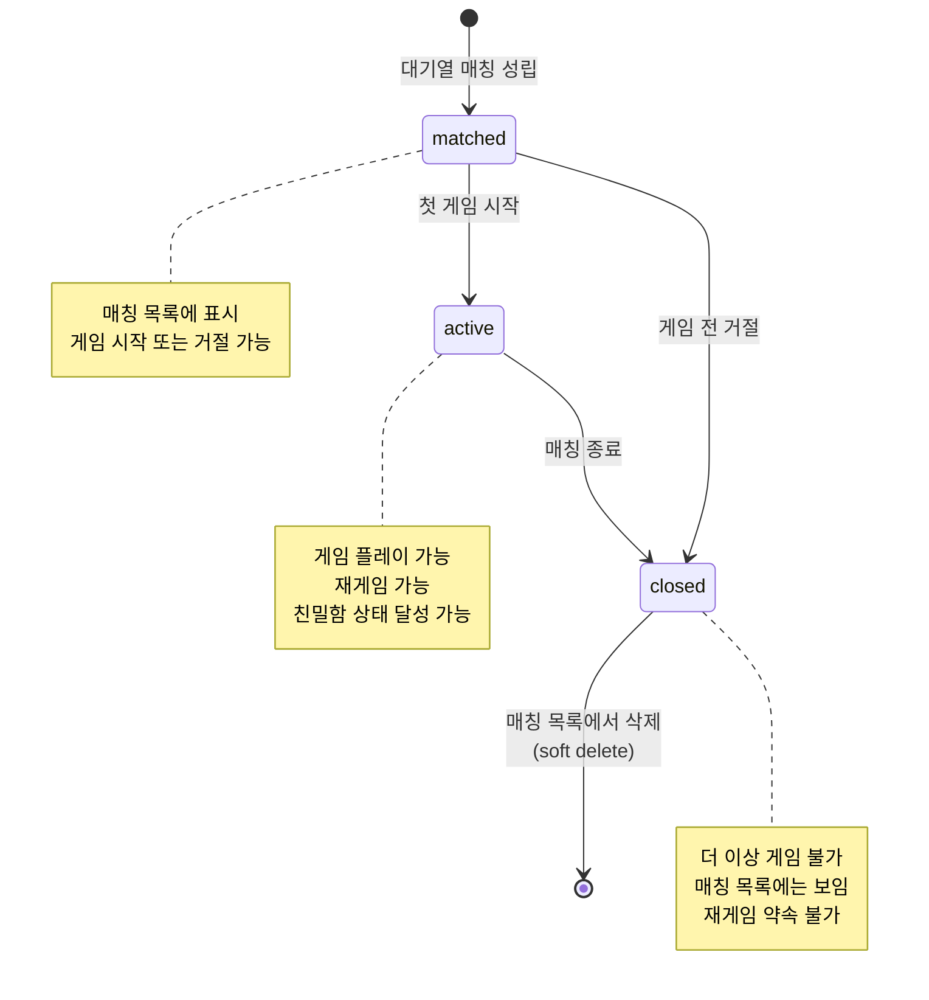

### Order 상태

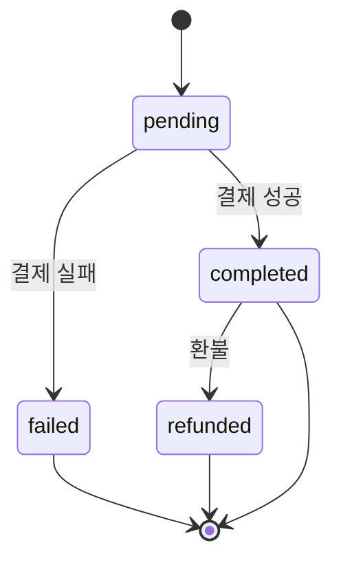

### Report 상태

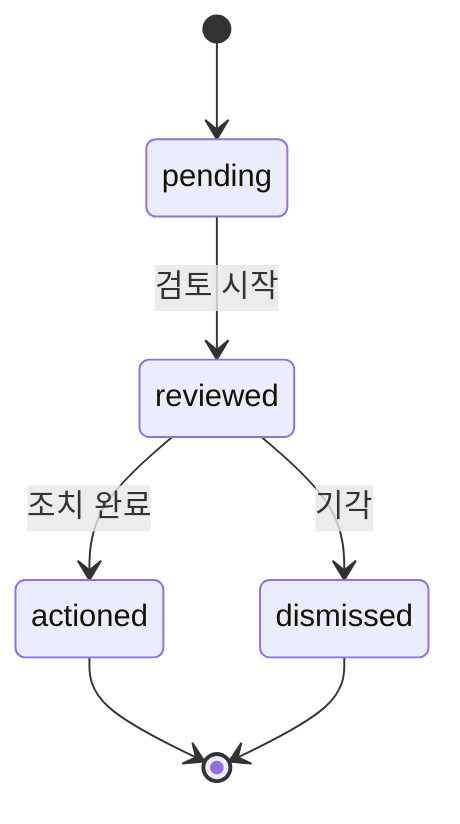

---

## 인덱스 전략 (초안)

**Users**:

- email (unique)
- email_verification_token (nullable)

**Profiles**:

- user_id (PK, FK)
- nickname (unique)

**MatchConditions**:

- match_id (FK)
- user_id (FK)

**Matches**:

- user_a_id, user_b_id (복합)
- is_intimate (친밀함 상태 필터링)
- created_at (최근 매칭 조회)
- deleted_at (soft delete 필터링)

**Plays**:

- match_id (FK)
- user_a_id, user_b_id

**MatchTickets**:

- user_id (PK, unique)

**GameTickets**:

- user_id (PK, unique)

**ContinueTickets**:

- user_id (PK, unique)

**ChatRooms**:

- match_id (unique, FK)

**Reports**:

- reported_user_id
- status

**GameAppointments**:

- match_id (FK)
- proposer_user_id, receiver_user_id (복합)
- status
- current_proposed_time (시간 기반 조회)
- deleted_at (soft delete 필터링)

**GameAppointmentHistory**:

- appointment_id (FK)
- created_at (시간순 조회)

---

## 목차 (빠른 이동)

### 도메인 엔티티
- [Duologue 도메인 모델](#duologue-도메인-모델)
  - [개요](#개요)
  - [핵심 도메인](#핵심-도메인)
    - [A. 회원 도메인](#a-회원-도메인)
      - [A.1. User (회원)](#a1-user-회원)
      - [A.2. Profile (프로필)](#a2-profile-프로필)
      - [A.3. MatchPreset (매칭 조건 프리셋)](#a3-matchpreset-매칭-조건-프리셋)
    - [B. 매칭 도메인](#b-매칭-도메인)
      - [B.1. MatchCondition (매칭 조건 스냅샷)](#b1-matchcondition-매칭-조건-스냅샷)
      - [B.2. Match (매칭)](#b2-match-매칭)
    - [C. 게임 도메인](#c-게임-도메인)
      - [C.1. Game (게임 종류)](#c1-game-게임-종류)
      - [C.2. Play (플레이 기록)](#c2-play-플레이-기록)
    - [D. 티켓 도메인](#d-티켓-도메인)
      - [D.1. MatchTicket (매칭 티켓)](#d1-matchticket-매칭-티켓)
      - [D.2. GameTicket (게임 티켓)](#d2-gameticket-게임-티켓)
      - [D.3. ContinueTicket (이어하기 티켓)](#d3-continueticket-이어하기-티켓)
    - [E. 소셜 도메인](#e-소셜-도메인)
      - [E.1. ChatRoom (대화방)](#e1-chatroom-대화방)
      - [E.2. ChatMessage (채팅 메시지)](#e2-chatmessage-채팅-메시지)
      - [E.3. GameAppointment (게임 약속)](#e3-gameappointment-게임-약속)
      - [E.4. GameAppointmentHistory (게임 약속 히스토리)](#e4-gameappointmenthistory-게임-약속-히스토리)
    - [F. 상거래 도메인](#f-상거래-도메인)
      - [F.1. Order (주문)](#f1-order-주문)
      - [F.2. Gift (선물)](#f2-gift-선물)
    - [G. 관리 도메인](#g-관리-도메인)
      - [G.1. Report (신고)](#g1-report-신고)
  - [엔티티 관계 다이어그램 (ERD)](#엔티티-관계-다이어그램-erd)
  - [주요 비즈니스 흐름](#주요-비즈니스-흐름)
    - [흐름 0: Passwordless 회원가입 및 로그인](#흐름-0-passwordless-회원가입-및-로그인)
      - [회원가입](#회원가입)
      - [로그인](#로그인)
    - [흐름 1: 새로운 매칭](#흐름-1-새로운-매칭)
    - [흐름 2: 게임 플레이 (새 매칭)](#흐름-2-게임-플레이-새-매칭)
    - [흐름 2-1: 재게임 (매칭 히스토리)](#흐름-2-1-재게임-매칭-히스토리)
    - [흐름 3: 이어하기](#흐름-3-이어하기)
    - [흐름 4: 친밀함 상태 및 대화 기능 활성화](#흐름-4-친밀함-상태-및-대화-기능-활성화)
    - [흐름 5: 게임 약속 (재게임)](#흐름-5-게임-약속-재게임)
  - [상태 다이어그램](#상태-다이어그램)
    - [Match 상태](#match-상태)
    - [Order 상태](#order-상태)
    - [Report 상태](#report-상태)
  - [인덱스 전략 (초안)](#인덱스-전략-초안)
  - [목차 (빠른 이동)](#목차-빠른-이동)
    - [도메인 엔티티](#도메인-엔티티)
    - [비즈니스 흐름](#비즈니스-흐름)
    - [기타](#기타)

### 비즈니스 흐름
- [흐름 0: 회원가입 및 이메일 인증](#흐름-0-회원가입-및-이메일-인증)
- [흐름 1: 새로운 매칭](#흐름-1-새로운-매칭)
- [흐름 2: 게임 플레이 (새 매칭)](#흐름-2-게임-플레이-새-매칭)
- [흐름 2-1: 재게임 (매칭 히스토리)](#흐름-2-1-재게임-매칭-히스토리)
- [흐름 3: 이어하기](#흐름-3-이어하기)
- [흐름 4: 친밀함 상태 및 대화 기능 활성화](#흐름-4-친밀함-상태-및-대화-기능-활성화)
- [흐름 5: 게임 약속 (재게임)](#흐름-5-게임-약속-재게임)

### 기타
- [엔티티 관계 다이어그램 (ERD)](#엔티티-관계-다이어그램-erd)
- [상태 다이어그램](#상태-다이어그램)
- [인덱스 전략](#인덱스-전략-초안)
