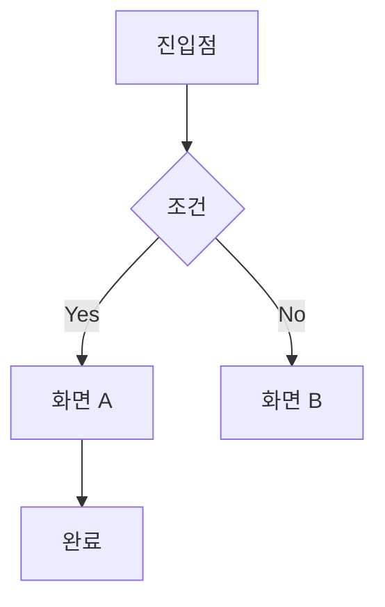

# [기능명] UI/UX 명세서

## 작성일
YYYY-MM-DD

## 버전
v1.0

## 개요
기능에 대한 전체적인 설명 (3-5문장)
- 어떤 화면/기능인지
- 주요 목적
- 사용자 가치

## 목적 및 배경
- 이 UI/기능이 필요한 이유
- 해결하려는 사용자 문제
- 비즈니스 가치

## 사용자 스토리
```
AS A [역할]
I WANT [원하는 것]
SO THAT [이유/목적]
```

## 화면 구성

### 화면 1: [화면명]
**경로**: `/path/to/screen`

**구성 요소**:
- 헤더
  - 타이틀
  - 뒤로가기 버튼
  - 기타 액션 버튼
- 메인 콘텐츠
  - 컴포넌트 1
  - 컴포넌트 2
- 하단 액션 (있다면)

**상태**:
- 로딩 상태
- 에러 상태
- 빈 상태
- 성공 상태

## 사용자 플로우



또는 텍스트로:
1. 사용자가 X 버튼 클릭
2. Y 화면으로 이동
3. 데이터 입력
4. 확인 버튼 클릭
5. 결과 화면 표시

## 기능 요구사항

### 필수 기능
1. **기능 1**
   - 설명: 구체적인 기능 설명
   - 사용자 액션: 버튼 클릭, 입력 등
   - 시스템 응답: 표시될 내용
   - 결과: 기대하는 결과

2. **기능 2**
   - 설명: ...
   - 사용자 액션: ...
   - 시스템 응답: ...
   - 결과: ...

### 선택 기능
1. **선택 기능 1**
   - 설명: ...
   - 우선순위: 낮음/보통/높음

## 데이터 요구사항

### API 연동
**엔드포인트 1**: `GET /api/v1/resource`
- 사용 시점: 화면 로드 시
- 응답 데이터:
  ```typescript
  interface Response {
    id: string;
    name: string;
  }
  ```
- React Query 키: `['resource']`

**엔드포인트 2**: `POST /api/v1/resource`
- 사용 시점: 버튼 클릭 시
- 요청 데이터:
  ```typescript
  interface Request {
    field1: string;
    field2: number;
  }
  ```
- 성공 처리: 성공 메시지 표시 후 이전 화면으로
- 실패 처리: 에러 메시지 표시

### 상태 관리
**글로벌 상태 (Zustand)**:
```typescript
interface StoreState {
  field1: string;
  field2: number;
  setField1: (value: string) => void;
}
```

**로컬 상태 (useState)**:
- 입력 필드 값
- 모달 열림/닫힘
- 등등

## UI 컴포넌트 구조

```
screens/
└── ScreenName.tsx
    ├── components/
    │   ├── Header.tsx
    │   ├── ContentSection.tsx
    │   └── ActionButton.tsx
    └── hooks/
        └── useScreenName.ts
```

### 재사용 컴포넌트
- `<Button />` - 공통 버튼
- `<Input />` - 입력 필드
- `<Card />` - 카드 컨테이너
- 기타

### 커스텀 컴포넌트 (신규 생성)
- `<ComponentName />` - 설명

## 인터랙션 및 애니메이션

### 터치/클릭 인터랙션
- 버튼: 클릭 시 스케일 애니메이션 (0.95)
- 리스트 아이템: 스와이프 제스처 지원
- 등등

### 화면 전환 애니메이션
- 진입: 우측에서 슬라이드
- 모달: 하단에서 슬라이드
- 페이드: 투명도 변화

### 로딩 상태
- 스피너 표시 위치
- 스켈레톤 UI (선택)

## 에러 처리

### API 에러
- 네트워크 오류: "인터넷 연결을 확인해주세요"
- 400: "잘못된 요청입니다"
- 401: 로그인 화면으로 리다이렉트
- 500: "일시적인 오류입니다. 잠시 후 다시 시도해주세요"

### 입력 검증 에러
- 필드명: "필수 항목입니다"
- 이메일: "올바른 이메일 형식이 아닙니다"
- 등등

### 에러 표시 방법
- 토스트 메시지
- 인라인 에러 텍스트
- 에러 모달

## 접근성 (Accessibility)

- [ ] 스크린 리더 지원 (accessibilityLabel)
- [ ] 키보드 네비게이션
- [ ] 색상 대비 (WCAG AA 기준)
- [ ] 터치 영역 크기 (최소 44x44)

## 반응형 / 적응형

### iOS
- Safe Area 고려
- 노치/다이나믹 아일랜드 대응

### Android
- 소프트 키 네비게이션 대응
- 다양한 화면 비율 지원

### 태블릿 (선택)
- 가로 모드 레이아웃
- 더 넓은 화면 활용

## 성능 요구사항

### 렌더링
- 초기 로딩: 2초 이내
- 리스트 스크롤: 60fps 유지
- 이미지 로딩: 레이지 로딩

### 메모리
- 이미지 캐싱 전략
- 불필요한 리렌더링 방지 (useMemo, useCallback)

## 제약사항 및 가정

- 제약사항 1: 최소 iOS 14+ 지원
- 제약사항 2: ...
- 가정 1: 사용자는 이미 로그인된 상태
- 가정 2: ...

## 의존성

### 화면 의존성
- 선행 화면: 이전 화면 이름
- 후속 화면: 다음 화면 이름

### 기능 의존성
- 백엔드 API: Phase X 완료 필요
- 다른 UI 컴포넌트: 컴포넌트명

## 테스트 시나리오

### 정상 시나리오
1. **시나리오 1: 기본 흐름**
   - 전제 조건: 사용자가 로그인된 상태
   - 실행 단계:
     1. 화면 진입
     2. 데이터 로딩 확인
     3. 버튼 클릭
   - 예상 결과: 성공 메시지 표시

### 예외 시나리오
1. **시나리오 1: 네트워크 오류**
   - 전제 조건: 인터넷 연결 없음
   - 실행 단계: 화면 진입
   - 예상 결과: 에러 메시지 표시

### 엣지 케이스
1. **케이스 1: 빈 데이터**
   - 상황: API가 빈 배열 반환
   - 처리 방법: "아직 데이터가 없습니다" 표시

## 디자인 참고

### 디자인 시스템
- 컬러: `theme.colors.primary`, `theme.colors.secondary`
- 타이포그래피: `theme.fonts.heading`, `theme.fonts.body`
- 스페이싱: `theme.space[4]` (16px)

### 디자인 파일
- Figma 링크: [링크]
- 스타일 가이드: [링크]

## 마일스톤

- [ ] Phase 1: 기본 UI 구현 (예상일: YYYY-MM-DD)
- [ ] Phase 2: API 연동 (예상일: YYYY-MM-DD)
- [ ] Phase 3: 최적화 (예상일: YYYY-MM-DD)

## 참고 자료

- [백엔드 API 명세](../specs/backend-spec-name.md)
- [도메인 모델](../specs/domain-model.md)
- 관련 라이브러리 문서

## 변경 이력

| 날짜 | 버전 | 변경 내용 | 작성자 |
|------|------|-----------|--------|
| YYYY-MM-DD | v1.0 | 초안 작성 | - |
